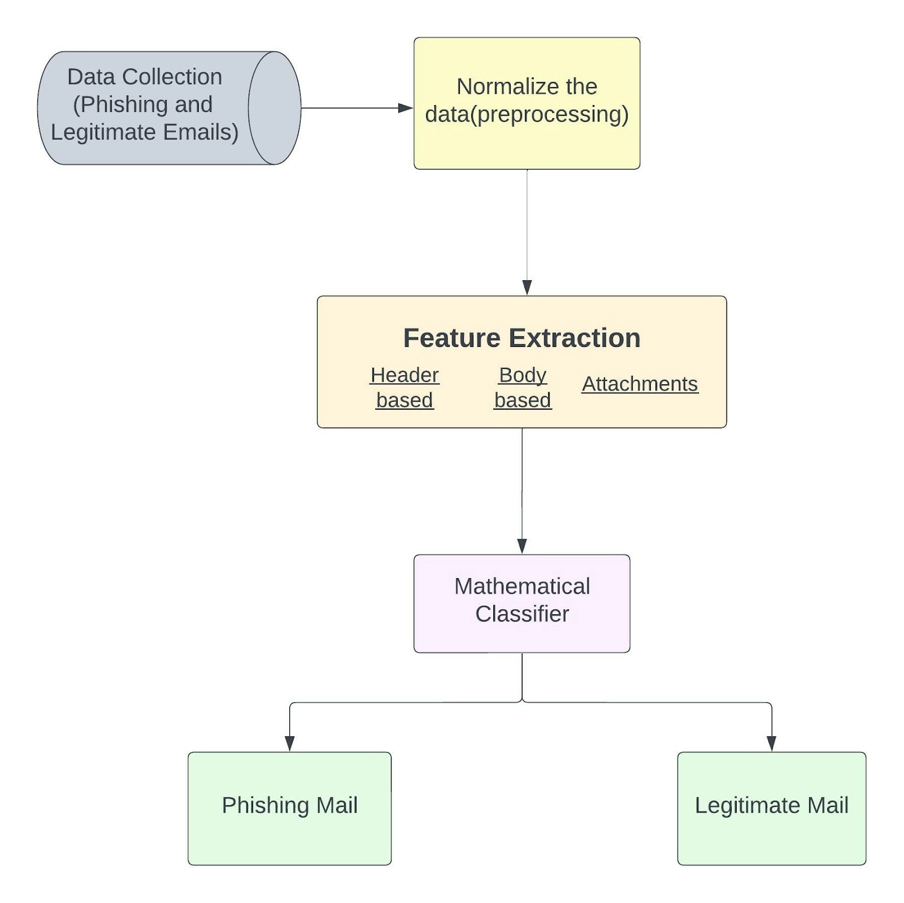

# Phishing Email Detection

Emails are a popular form of communication for both personal and business purposes. Sensitive and private information, such as banking details, credit reports, login information, etc., is frequently sent by email. Because of this, they are important to cybercriminals who might misuse the data. Phishing is a technique used by con artists to trick people into giving up sensitive information by seeming to come from reliable sources. 

In a phished email, the sender can trick the victim into giving up personal information so we have to be aware of that. This project aims to solve this problem. It will help in detecting the phishing email and henceforth the upcoming troubles after giving up your personal information to them.

## Objective

The following are the project's objectives :
- Using manual feature selection based on email structure, identify and assess the ideal collection of features to be used for phishing Email detection.
- To choose the most effective classifier for phishing detection.
- To optimize the performance of the classification algorithm.
- Create a system that combines various classification methods for phishing email detection and assess how well it works.
- Evaluate each model's performance metrics.

## Scope and Limitation

The scope of this research is phishing emails detection, where features are extracted from the mails. Moreover, Naive Bayes, Random Forest, Logistic Regression and other top classification ML algorithms were used for phishing emails detection. This research also target to develop an integration of best performing classifier for better prediction.

For the limitation, this research will not cover the phishing websites, moreover the experiments will not cover all the available classification algorithms. However, this study will evaluate experimentally the most well-known algorithms.

## Workflow

